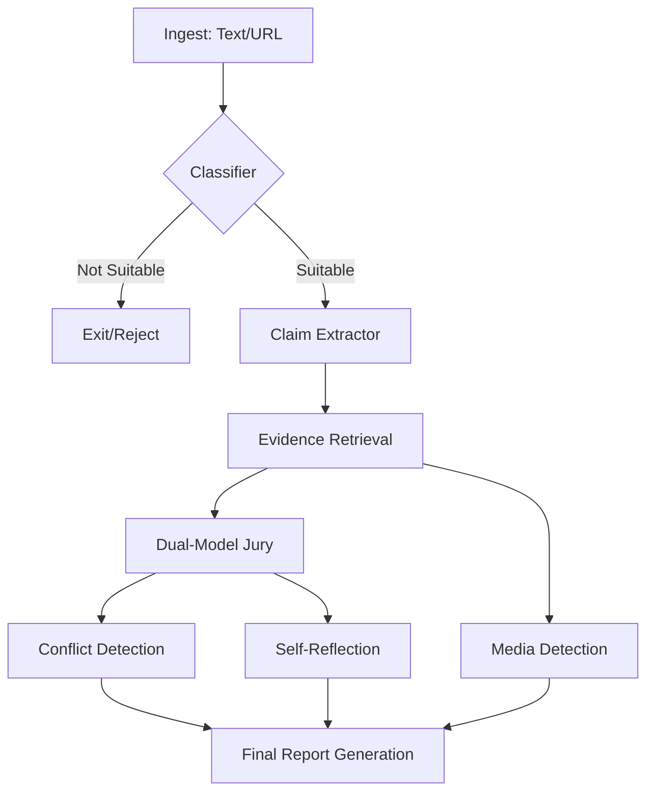

# 🛡️ <span style="font-family: 'Syne', sans-serif; font-weight: 800;">VERITAS</span> — Truth Intelligence Platform

[](https://opensource.org/licenses/MIT)
[](https://fastapi.tiangolo.com/)
[](https://reactjs.org/)
[](https://langchain-ai.github.io/langgraph/)
[](https://groq.com/)

**Veritas** is a professional-grade fact-checking and claim verification system. It leverages a multi-tiered AI agent architecture orchestrated via **LangGraph** to autonomously ingest content, extract atomic claims, retrieve cross-referenced evidence, and deliver high-confidence verdicts with self-reflective critique.

---

## 🚀 Key Features

- **Automated Claim Extraction**: Shreds complex articles into verifiable atomic claims using Llama-3.3-70B.
- **Multi-Source Evidence Retrieval**: Parallel search across **Tavily**, **Wikidata**, **Wikipedia**, **World Bank**, and **OpenFDA**.
- **Dual-Model Jury Verification**: Cross-verification by independent agent observers to ensure unbiased accuracy.
- **Deepfake & AI Detection**: Integrated **Hive AI** imaging analysis and deterministic AI text origin scoring.
- **Self-Reflection Architecture**: Every verdict is scrutinized by an independent "Skeptical Reviewer" agent to identify potential bias or outdated evidence.
- **Real-Time Streaming**: Live pipeline visualization using Server-Sent Events (SSE).

---

## 🏗️ Technical Architecture

Veritas uses a directed acyclic graph (DAG) to manage state and logic across the intelligence pipeline.



---

## 🛠️ Tech Stack

### Backend
- **Framework**: FastAPI (Python)
- **Orchestration**: LangGraph (for complex agent state management)
- **Primary LLM**: Llama-3.3-70B-Versatile (via Groq)
- **Secondary LLM**: Llama-3.1-8B-Instant (for classification & reflection)
- **Search Engine**: Tavily AI
- **Scraping**: Playwright, BeautifulSoup4, Trafilatura
- **Media Analysis**: Hive AI (Deepfake/AI detection)

### Frontend
- **Framework**: React 18
- **State Management**: Context API + Custom Hooks
- **Styling**: Vanilla CSS (Modern Design System)
- **Visualization**: SVG-based live indicators and confidence gauges

---

## ⚙️ Setup & Configuration

### Prerequisites
- Python 3.10+
- Node.js 18+
- [Groq API Key](https://console.groq.com/)
- [Tavily API Key](https://tavily.com/)
- [Hive API Key](https://dashboard.thehive.ai/) (Optional, for media detection)

### Installation

1. **Clone the repository**:
   ```bash
   git clone https://github.com/Raghavapranav3443/AI_Fact_Checker.git
   cd AI_Fact_Checker
   ```

2. **Backend Setup**:
   ```bash
   cd backend
   cp .env.example .env
   # Edit .env and add your API keys
   ./start.sh
   # On Windows, use "python main.py" after setting up venv manually
   ```

3. **Frontend Setup**:
   ```bash
   cd ../frontend
   npm install
   npm run dev
   ```

---

## 📂 Core Logic Pointers

For developers interested in the underlying verification logic, please refer to:
- **Pipeline Orchestration**: [graph.py](file:///c:/Users/Rupesh/Desktop/Pranav/GfG_Hackathon-Veritas/veritas/backend/pipeline/graph.py)
- **Verification Agents**: [verifier.py](file:///c:/Users/Rupesh/Desktop/Pranav/GfG_Hackathon-Veritas/veritas/backend/agents/verifier.py)
- **Claim Extraction**: [extractor.py](file:///c:/Users/Rupesh/Desktop/Pranav/GfG_Hackathon-Veritas/veritas/backend/agents/extractor.py)
- **Deepfake/Media Detection**: [media_detector.py](file:///c:/Users/Rupesh/Desktop/Pranav/GfG_Hackathon-Veritas/veritas/backend/agents/media_detector.py)
- **Evidence Retrieval**: [tavily_search.py](file:///c:/Users/Rupesh/Desktop/Pranav/GfG_Hackathon-Veritas/veritas/backend/utils/tavily_search.py)

---

## ⚖️ License
Distributed under the MIT License. See `LICENSE` for more information.
